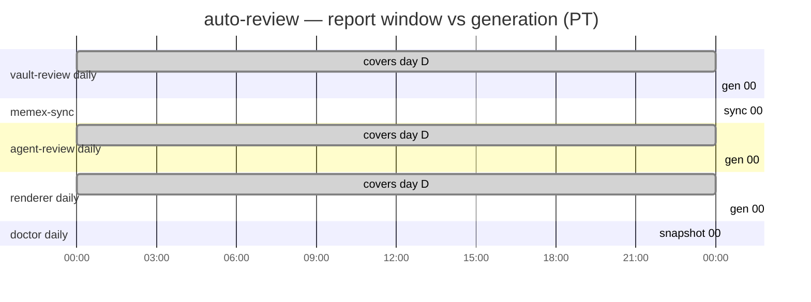

# Schedules & job dependencies

Source of truth for the auto-review cron layout on the **auto-review LXC**
(`auto-review@192.168.5.223`, TZ `America/Los_Angeles` — **all times PT**).

The crontab is **hand-maintained**: `scripts/deploy.sh` and the doctor
deliberately never auto-edit it (AGENTS.md). To change it, edit on the box with
a backup + gated install (see [Changing the schedule](#changing-the-schedule)),
**and** update the `JOBS` registry in `doctor/auto-review-doctor` (it drives the
doctor's liveness display and regenerates `reference/auto-review/moving-pieces.md`).

## The nightly chain

Every daily job reports on **yesterday** (`D`) and runs in a tight cluster just
after midnight on `D+1`. `t_a → t_b` is the data window a report covers; `t_r`
is when it's generated.

| Job | cron (PT) | covers `t_a → t_b` | `t_r` | writes | git push |
|---|---|---|---|:--:|:--:|
| `vault-sync-pull` | `*/5 * * * *` | — (ff-pull of vault) | continuous | vault tree | pull only |
| `run-recap-daily` (vault-review) | `1 0 * * *` | `D 00:00:00 → D 23:59:59` | `D+1 00:01` | note `D` | ✔ |
| `run-memex-sync` | `5 * * * *` | — (hourly capture mirror) | `:05` each hr | captures (PG) | ✗ |
| `run-recap-weekly` | `8 0 * * 1` | `Mon 00:00 → next Mon 00:00` (Mon–Sun = week `W`) | `Mon-after-W 00:08` | weekly note `YYYY-W##` | ✔ |
| `run-agent-review-daily` | `8 0 * * *` | `D 00:00:00 → D+1 00:00:00` | `D+1 00:08` | `agent_review.daily_reports[D]` (PG) | ✗ (`--no-vault`) |
| `run-checkin-renderer-daily` | `19 0 * * *` | composes note `D` from PG rows for `D` | `D+1 00:19` | note `D` + `ops.job_runs` | ✔ |
| `run-auto-review-doctor` | `22 0 * * *` | liveness snapshot (no data window) | `D+1 00:22` | note `D+1` (own §); assesses `D` | ✔ |
| `run-checkin-catchup` | `0 10 * * *` | re-composes note `D` IFF a producer row is missing | `D+1 10:00` | note `D` (only on a gap) | ✔ (only on a gap) |

Run order on the `D+1` morning:

```
00:01  vault-review daily                            (independent; reads vault git)
00:05  memex-sync                                    (stragglers in before render)
00:08  agent-review  ∥  vault-review weekly (Mon)     (agent: ≥8 min after the agentsview push)
00:19  check-in renderer                             (~11 min after agent-review)
00:22  doctor                                        (LAST — sees everything above)
…
10:00  check-in catch-up (hg6.11)                    (gap-gated backfill; no-op on a healthy night)
```

The `10:00` slot is the producer→consumer-race **catch-up** (`auto-review-hg6.11`,
OPTION 3), the back half of buffer #2 below. It sits ~10 h after the `00:08`
producer run so a transient LLM-gateway/DB blip has had time to clear. It is
**gap-gated**: it probes Postgres read-only for `agent_review.daily_reports[D]`
and re-runs `agent-review run D --no-vault` + `checkin-renderer run D` (both
idempotent — the re-run cleanly REPLACES the placeholder) **only when that row
is missing**. On a healthy night the row is present, so it logs `no backfill
needed for D` and exits 0 — a clean no-op. Because it legitimately no-ops on most
days it is **catalogued `monitored=False`** in the doctor's `JOBS` registry (a
liveness window would false-positive every quiet day; see
`doctor/auto-review-doctor`). v0 covers the `agent-review` producer only — the
documented incident; the same placeholder reproduces for the vault/memex
sections on a pre-render blip, and broadening the catch-up to them is a
follow-up.

## Dependency graph

```
 baox → agentsview PG  (push ~23:55 + 00:00)        vault-sync (every 5 min)
        │ ~8 min margin                                    │ keeps vault current
        ▼                                                  
 ┌─ agent-review ─┐  writes daily_reports[D] (PG)          
 │                ├──HARD──► renderer ──SOFT(run last)──► doctor
 ├─ memex-sync ───┘  writes captures (PG)                  
 │                                                         
 └─ vault-review (daily & weekly)   independent: git → note; only git-serializes
```

There are **two real serial buffers** and one ordering rule — everything else is
arbitrary:

1. **agentsview push → `agent-review` (~8 min).** agent-review reads agentsview
   PG, which baox pushes at ~23:55 + the 00:00 `*/30` boundary. It must read
   *after* the prior day's sessions land, or the daily report is silently
   incomplete (and it won't re-run). This buffer was 21 min pre-tightening;
   trimmed to ~8. **Treat as a health threshold:** if the push isn't done in
   8 min, fix the push — don't widen the gap. ⚠ external-host dependency.
2. **`agent-review` + `memex-sync` → `renderer` (~11 min, hard/data.)** The
   renderer reads their PG rows; if it runs first it renders a placeholder
   (`_no agent-review report row for D_`). This is the producer→consumer race —
   `auto-review-hg6.11`. Same health-threshold logic: a run nearing 11 min is
   *broken* (LLM-gateway retry storm), and the fix is `hg6.11`'s catch-up, not a
   wider cushion. **The catch-up (`run-checkin-catchup`, `0 10 * * *`) is the
   implemented stopgap (OPTION 3):** a transient producer failure bakes a
   permanent placeholder into note `D` (nothing re-runs), so the `10:00` job
   re-runs the producer + renderer for `D` *only when its PG row is missing* —
   giving the gateway ~10 h to recover after the `00:08` run. It's gap-gated and
   idempotent, so it's a clean no-op on every healthy night (hence
   `monitored=False` in the doctor registry). See the `10:00` entry above and
   `renderer/deploy/run-checkin-catchup.sh`.
3. **`doctor` runs last** (soft, liveness). It judges the others' freshness
   (`ops.job_runs` + section markers), so it must run after them — including the
   weekly, which is why the weekly sits at `00:08` (before the `00:22` doctor)
   instead of `10:01`. See `auto-review-hg6.12`.

Not ordered: `vault-review` (daily/weekly) shares no data with the PG chain — it
only **git-serializes** with `doctor`/`renderer` on the vault repo, and
concurrent pushes are absorbed by `pull --rebase` + one retry
(`auto-review-qgo`), so seconds of spacing suffice, not minutes.

## Why the stagger is small

The old layout spread these over ~50 min (`00:01 → 00:51`) with no real reason
beyond habit, and had the **doctor mis-slotted** at `00:31` — *before* the
`00:51` renderer — so its renderer/weekly liveness reads were always a cycle
behind (the root of the `hg6.12` weekly false-positive). The tightened layout is
~22 min, doctor last, with buffers kept only where a real dependency lives
(buffers #1 and #2 above).

## Timeline (visual)

```
 DATA DAY D ── the full calendar day every nightly report covers ──
 D 00:00                                                        D 23:59:59
 ╞═══════════════════════════════════════════════════════════════════════╡  t_a … t_b
 │            (vault commits / agent sessions / captures accrue)           │
 └──────────────────────────────────────────────────────────────────────┬─┘
                                                          window closes   ▼
   D+1, ~22-min cluster, dependency-ordered, all cover D:
     00:01 ┃▸ vault-review daily   [D 00:00:00 → D 23:59:59]  → note D
     00:05 ┃▸ memex-sync           (captures straggler sync)
     00:08 ┃▸ agent-review daily   [D 00:00:00 → D+1 00:00)   → PG row report_date=D
     00:08 ┃▸ vault-review weekly  [week W, Mon–Sun]  · Mondays only → weekly note
     00:19 ┃▸ check-in renderer    composes note D from PG    → note D
     00:22 ┃▸ doctor (snapshot)    liveness of all the above  → note D+1
            └──────── ~22 min ────────┘

 WEEKLY window (covers week W = Mon–Sun), generated the next Monday 00:08:
 Mon W ──────────────────── 7 days ──────────────────── Sun W 23:59:59 │ next Mon 00:08 ▸
   (was Sun 10:01 pre-2026-06-16 → recaps lagged a full week; see changelog)
```

Embeddable Mermaid (nightly cluster against the 24 h window):



## Changing the schedule

Edit on the box; never let tooling auto-edit it. Always back up + diff + verify:

```bash
crontab -l > ~/crontab.bak.<change>          # always back up first
# build the new crontab into /tmp/crontab.new, then:
diff ~/crontab.bak.<change> /tmp/crontab.new # eyeball it
crontab /tmp/crontab.new                      # install
crontab -l                                    # verify
# revert if needed: crontab ~/crontab.bak.<change>
```

Then update `JOBS` in `doctor/auto-review-doctor` (cadence + `hhmm`) and redeploy
the doctor so the dashboard/display match.

## Related issues

- `auto-review-hg6.11` — renderer/producer race window (the `agent → renderer`
  gap); a transient producer failure bakes a permanent placeholder. The `10:00`
  gap-gated catch-up (`run-checkin-catchup`, OPTION 3) is the implemented
  stopgap; a fuller doctor-driven / wrapper-retry self-heal (and broadening past
  the agent-review producer) remains follow-up.
- `auto-review-hg6.12` — doctor weekly false-positive. The **scheduling half**
  (doctor now runs last, weekly folded into the Monday cluster before it) is
  addressed by this layout; the **liveness half** folds into `auto-review-2vv`.
- `auto-review-2vv` — move vault-review (daily+weekly) onto `ops.job_runs`
  liveness, retiring the fragile log+marker + `reported_week_label` timing.
- `auto-review-qgo` — concurrent vault pushes; handled by `pull --rebase` +
  retry in every git-writing wrapper.

## Changelog

- **2026-06-16** — Weekly cron day fixed Sunday→Monday (`1 10 * * 0` →
  `8 0 * * 1`); recaps had lagged a full week. Nightly stagger tightened
  `00:01–00:51` → `00:01–00:22`: doctor moved last (`00:31`→`00:22`), renderer
  `00:51`→`00:19`, agent-review `00:21`→`00:08` (keeping ~8 min margin after the
  agentsview push — a first cut to `00:01` was reverted as too tight for that
  feed), memex `:41`→`:05`, weekly folded into the Monday cluster
  (`10:01`→`00:08`). Backups on the box: `~/crontab.bak.weekly-day-fix`,
  `~/crontab.bak.tighten-stagger`, `~/crontab.bak.agentsview-margin`.
